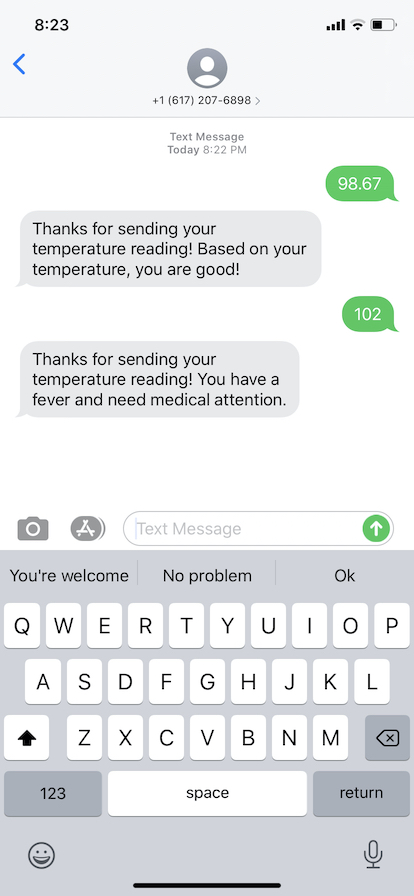

# Overview
Allow relevant people to take temperature several times a day and text their temperature readings.

# Background
On Saturday, March 21, 2020, 8:15 AM EST, Tufts University President Anthony Monaco sent this email to a few people:

> We have a major challenge but a new approach for which I would like to get your immediate feedback. Tufts is ready and willing to set up a test site for Medford and Somerville. We have no local hospital to partner with and that is the only way we can get medical personnel here to staff the site and send samples off for testing. Testing and isolation are the only weapons we have. Mike Apkon at TMC is looking into a possible solution. We can house and feed medical personnel from other test sites which we are planning to start next week.

> Another more tech solution. It has been shown in China and Italy (in one small village) that if you visit every household and test for fever and cough and immediately isolate cases right now in the curve, you can significantly reduce spread and mortality rates. Medford has a population in 2019 of about 60,000 and 1500 households with vulnerable members >75 years old. We could visit and test each household for fever and cough, like in China. Requires a mobile medical unit and Mike Apkon is looking into it today. Another approach would be to provide IOT-linked thermometers to each household in Medford with anyone over 75. Fever can be monitored remotely, and we then only have to visit a few households to isolate those who develop fever before they spread to vulnerable family members. I found a story about IOT-linked thermometers being used like this so can we explore https://www.nytimes.com/2020/03/18/health/coronavirus-fever-thermometers.html

> Hurry please. This is a race against time.

I wasn't on the initial email, but Tufts Computer Science Department Chair Kathleen Fisher added me on email at 9:16 AM EST.

# Requirements
* "The plan is to contact all relevant people (75 and older, etc.) and ask them to take their temperature several times a day and either text or email us their readings."
* "If fever is sustained (especially with new cough), we can send simple instructions on how to drive to the nearest test center for medical evaluation and consideration for isolation somewhere."
* "Anything that requires medical personnel and PPE is going to be a bottleneck as both are already in terribly short supply."

# Technology Stack
* Node.js + Express
* PostgreSQL
* Twilio API
* Heroku

# Database Design
* SQL for querying and reporting; no MongoDB
* Collect less is more
* One table: `temperature_readings`
  - telephone_number:text field
  - temperature:float
  - created_on:datetime

# Setup
* Clone this project
* `cd MedfordTemperatureReporting`
* `heroku create`
* `heroku addons:create heroku-postgresql:hobby-dev`
* `heroku config:set TWILIO_ACCOUNT_SID=<INSERT TWILIO ACCOUNT ID HERE>`
* `heroku config:set TWILIO_API_KEY=<INSERT TWILIO API KEY HERE>`
* `heroku config:set TWILIO_API_SECRET=<INSERT TWILIO API SECRET HERE>`
* `heroku config:set TWILIO_AUTH_TOKEN=<INSERT TWILIO AUTH TOKEN HERE>`
* Run `heroku pg:psql` and run `CREATE TABLE temperature_readings (id SERIAL PRIMARY KEY, telephone_number TEXT NOT NULL, temperature DECIMAL NOT NULL, sent_on TIMESTAMP NOT NULL DEFAULT CURRENT_TIMESTAMP);`
* `git push heroku master`
* Purchase telephone number on Twilio.  Set the SMS webhook to app running on Heroku at `POST /sms`

# References Used
* https://www.twilio.com/docs/sms/quickstart/node
* https://www.twilio.com/docs/usage/secure-credentials
* https://www.twilio.com/blog/parsing-an-incoming-twilio-sms-webhook-with-node-js
* https://devcenter.heroku.com/articles/heroku-postgresql#connecting-in-node-js
* https://devcenter.heroku.com/articles/getting-started-with-nodejs#provision-a-database
* https://www.twilio.com/docs/usage/tutorials/how-to-secure-your-express-app-by-validating-incoming-twilio-requests

# "First Cut of Infrastructure You Can Test Out Now"
On Saturday, March 21, 2020, 8:45 PM EST, a little over 12 hours after the initial email from President Monaco, I wrote this to all stakeholders:

> I have created initial infrastructure for this Medford Temperature Recording system.

> Instructions: text your temperature to (617) 207-6898.  Again, just text one single number to (617) 207-6898.  That's it.  See attached screenshot.

> Quick points:

> * Based on the many emails and from the Google Doc James put together, I built infrastructure based on two key points: (1) The plan is to contact all relevant people (e.g., over 75 years old) and ask them to take their temperature several times a day and text us their readings; (2) If fever is sustained (esp with new cough), we can send simple instructions on how to drive to the nearest test center for medical evaluation and consideration for isolation somewhere.

> * What data is stored in database: phone number, the temperature reading, and timestamp --only three pieces of information.  If a phone number sends 11 temperature readings, then all 11 temperature readings will be stored but with differing timestamp.

> * Currently there is no interface or web page for someone (e.g., an administrator) to see all the temperatures and phone numbers.

> * The text message sent as response back to person needs work.  Example: what should the appropriate response be when someone's temperature is 102 degrees?

> * Security features: (1) temperature entry must come from a phone via SMS, (2) if text message sent by person contains anything else other than a temperature reading (e.g., letters), message is discarded.

> * Time I spent on this: Since 2 PM EST to now, so 6+ hours.  Yes, I built this myself.

> * The tech stack used:
>  - Programming Language: Server-side JavaScript (Node.js)
>  - Cloud infrastructure: Heroku (free tier currently, but needs to be bumped up to paid instance once this is rolled out for public use)
>  - Database: PostgreSQL via Heroku
>  - Text messaging: Twilio (NOTE: this is NOT free, currently loaded with $25.00 with my own money)

> Let me know what your thoughts are.  Thanks.

# Decommissioned
* App was hosted on Heroku as `medford-temperature-reporting`.  App was deleted on July 7, 2020.
* Twilio phone number (617) 207-6898 was released on July 7, 2020